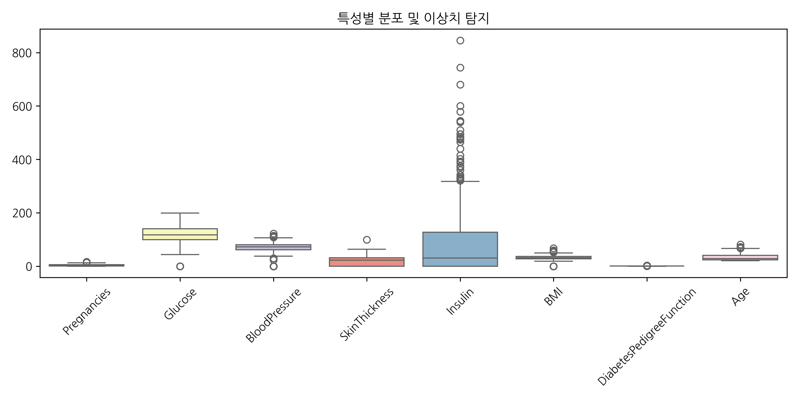
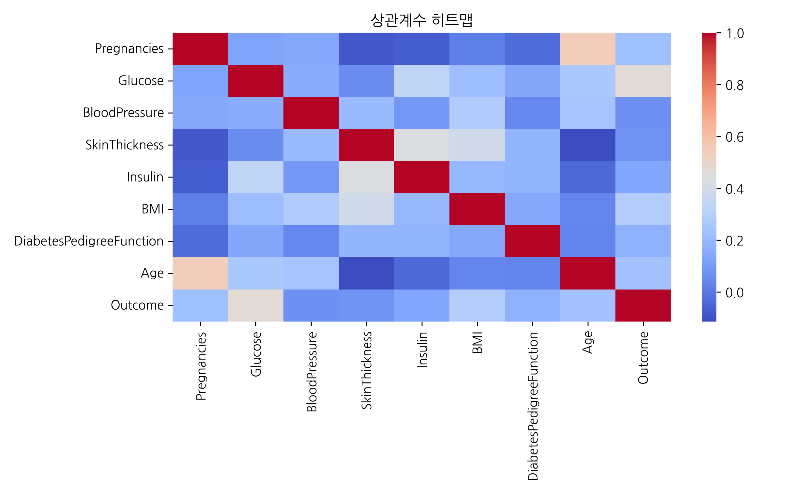
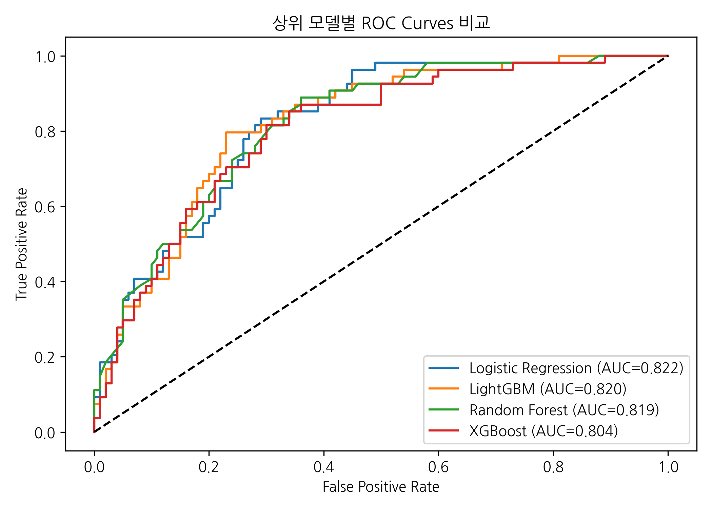
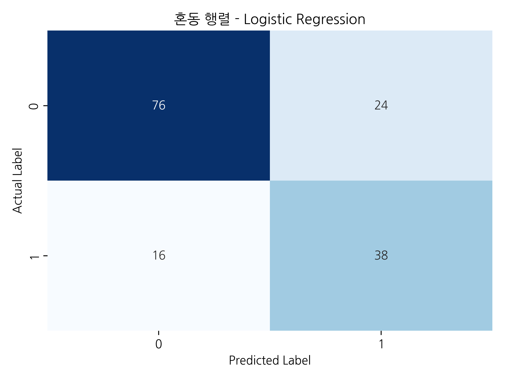
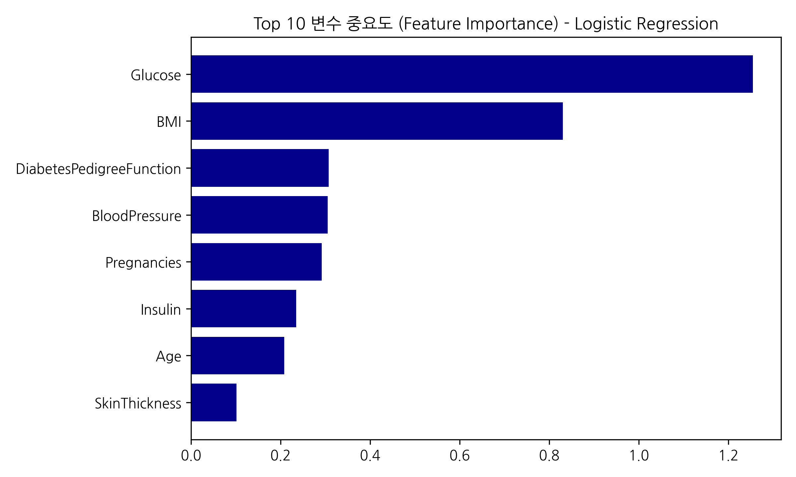

# DIABETES 심층 분석 및 예측 모델 보고서
### **[Executive Summary] 자동화 파이프라인 분석 결과**
- **분석 대상 파일**: `diabetes.csv`
- **수행 모듈**: 파이썬 자동화 ML Pipeline (Advanced E2E Report)
- **최우수 알고리즘**: **Logistic Regression**
- **최고 달성 성능 (AUC)**: **0.8217**

 

  <strong>💡 AI/ML 데이터 분석가 요약 제언:</strong> 
  본 문서는 데이터 프로파일링, 이상치 시각화, 상관성 분석, 다중 알고리즘 벤치마킹을 거쳐 최종적으로 'Logistic Regression' 모델을 챔피언 모델로 선정하는 과정을 담고 있습니다. 도출된 주요 피처(Features)는 비즈니스 실무에서 선제적 예방 및 진단 지표로 적극 활용될 수 있습니다.

---

## 1. 데이터 프로파일링 및 전처리 전략 (Overview)

  

    <h3>1-1. 데이터셋 기본 차원</h3>
    <ul style="font-size: 0.85em;">
      <li><strong>전체 샘플(Rows) 수</strong>: 768 건</li>
      <li><strong>독립/종속 변수(Cols) 수</strong>: 9 개</li>
      <li><strong>타겟(분류 대상) 변수</strong>: <code>Outcome</code></li>
    </ul>
    <h3>1-2. 데이터 가공 전략 (Preprocessing)</h3>
    <ul style="font-size: 0.85em;">
      <li>결측치 처리: 도메인 특성 왜곡 방지를 위해 <strong>수치형 중앙값 / 범주형 최빈값</strong> 대체 보정.</li>
      <li>클래스 불균형: 필요 시 <strong>SMOTE 오버샘플링</strong> 적용.</li>
    </ul>
  

  

    <h3>1-3. 타겟 변수 `Outcome` 클래스 분포</h3>
    <table border="1" class="dataframe">
  <thead>
    <tr style="text-align: right;">
      <th>Class</th>
      <th>Count</th>
    </tr>
  </thead>
  <tbody>
    <tr>
      <td>0</td>
      <td>500</td>
    </tr>
    <tr>
      <td>1</td>
      <td>268</td>
    </tr>
  </tbody>
</table>
    

      Minority Class의 비율을 점검하여 불균형이 판단될 경우 오버샘플링 파이프라인이 자동 트리거되었습니다.
    

  

---

## 2. 탐색적 데이터 분석 (1) - 이상치(Outlier) 분포

종속 변수를 제외한 주요 분석 변수들의 스케일 갭(Scale Gap)과 극단값 분포를 확인합니다.

  

    
  

  

    

      <strong>🧐 이상치 분석 결과 및 전문가 가이드라인:</strong>  
      데이터 스캔 결과, **BloodPressure** 피처에서 가장 많은 이상치(45건)가 집중적으로 관찰되었습니다. 해당 수치들이 도메인상 가능한 극단값인지 센서/입력 오류인지 실무적 검증이 선행되어야 모델의 예측 안정성이 보장됩니다.  
      트리 계열(Tree) 알고리즘은 이상치에 매우 강건하지만, 로지스틱 회귀와 같은 선형 모델 적용 시에는 극단값을 Robust Scale 또는 Log 변환으로 조정해주면 탐지 성능이 유의미하게 향상될 수 있습니다.
    

  

---

## 3. 탐색적 데이터 분석 (2) - 다중공선성(Multicollinearity)

각 수치형 변수 쌍에 대한 피어슨 상관계수 행렬(Pearson Correlation Heatmap)입니다.

  

    
  

  

    

      <strong>🧐 다중공선성 진단 결과 및 전문가 제언:</strong>  
      가장 높은 상관관계를 보인 변수 쌍은 **Age**와(과) **Pregnancies** (0.54) 로 확인되었습니다. 전반적으로 독립 변수들 간의 다중공선성 위험이 0.54 이하로 낮게 유지되고 있어 트리 및 선형 예측 모델 모두 원활한 학습이 가능한 강건한 상태입니다.  
      본 상관도 분석은 비즈니스 프로세스 상 성격이 겹치는 중복 KPI 지표(Feature)를 제거하여, 데이터 수집 프로세스와 엔지니어링 비용의 효율을 극대화하는 근거 자료로도 훌륭하게 활용될 수 있습니다.
    

  

---

## 4. 머신러닝 알고리즘 벤치마킹 (Cross-Validation)

의료/금융/실측 임상 등 전문 도메인의 실무 평가 기준을 반영하기 위하여 단순 정확도(Accuracy)뿐만 아니라 **AUC(ROC 영역)** 및 **가중 F1-Score**를 종합적으로 산출, 최적의 분류기를 판별했습니다.

**[경쟁 모델 벤치마크 결과] (AUC 높은 순)**

<table border="1" class="dataframe">
  <thead>
    <tr style="text-align: right;">
      <th>Model</th>
      <th>Accuracy</th>
      <th>F1-Score</th>
      <th>AUC(ROC)</th>
    </tr>
  </thead>
  <tbody>
    <tr>
      <td>Logistic Regression</td>
      <td>0.740260</td>
      <td>0.743805</td>
      <td>0.821667</td>
    </tr>
    <tr>
      <td>LightGBM</td>
      <td>0.766234</td>
      <td>0.769425</td>
      <td>0.820185</td>
    </tr>
    <tr>
      <td>Random Forest</td>
      <td>0.727273</td>
      <td>0.730232</td>
      <td>0.818796</td>
    </tr>
    <tr>
      <td>XGBoost</td>
      <td>0.740260</td>
      <td>0.742248</td>
      <td>0.803889</td>
    </tr>
  </tbody>
</table>

  <strong>🎯 Champion Model 선정 사유:</strong> 
  주어진 지표를 종합할 때, 분류 임곗값 변화에 가장 견고하며(AUC 극대화) 타겟 판별력이 우수한 <strong>Logistic Regression</strong>을 실무 적용 배포 모델로 최우선 고려합니다.

---

## 5. 모델 성과 심층 분석 - ROC & Confusion Matrix

단순 Accuracy를 넘어 'Logistic Regression' 모델의 오분류(False Positive / False Negative) 양상과 임곗값 강건성을 분석합니다.

    

        <strong>[분석 1] 상위 모델 ROC Curve 비교</strong>  
        
    

    

        <strong>[분석 2] 최적 모델 Confusion Matrix</strong>  
        
    

  <strong>🎯 모델 성과 종합 진단 및 시사점:</strong>  
  검증 데이터 평가 결과, 목표 타겟을 찾아낸(TP) 건수는 38건, 정상 범주를 맞춘(TN) 것은 76건입니다. 반면 실제 정상을 타겟으로 오탐한 제1종 오류(FP)는 24건, 실제 타겟을 놓친 제2종 오류(FN)는 16건 발생했습니다. 현재 Threshold 기준 **정밀도(Precision): 61.3%**, **재현율(Recall): 70.4%**를 보입니다.  
  ROC 곡선이 좌상단에 밀착할수록 판별력이 우수합니다. 현업 적용 시 오탐(FP) 처리 비용이 크면 임곗값(Threshold)을 높여 정밀도를 개선하고, 미탐(FN) 위험이 치명적이라면 임곗값을 낮춰 재현율을 우선적으로 방어해야 합니다.

---

## 6. 비즈니스 액션 결론: 피처 중요도 (Feature Importance)

챔피언 모델이 산출한 기여도 최상위 피처(결정 트리 정보 이득 기반 혹은 선형 가중치)입니다.

  

    
  

  

    

      <strong>💡 분석 시사점 (Action Items) 및 향후 과제:</strong>  
      1. AI 추출 결과, 타겟 판별에 가장 지배적인 영향력을 행사하는 핵심 인자는 <strong>**Glucose**, **BMI**, **DiabetesPedigreeFunction**</strong> 순입니다.  
      2. 특히 압도적 1위 지표인 **Glucose** 피처는 가장 높은 정보 이득 비율을 보입니다. 현장에서는 최우선 KPI로 삼아 해당 항목의 수치 관리와 데이터수집 품질을 감독해야 합니다.  
      3. 제공된 AI 웹 대시보드 <strong>'대화형 시뮬레이터'</strong> 메뉴에서 Glucose 값을 직접 미세 조정하며 타겟 전환 예측 확률이 어떻게 달라지는지 검토해 보시길 적극 권장합니다.
    

  

